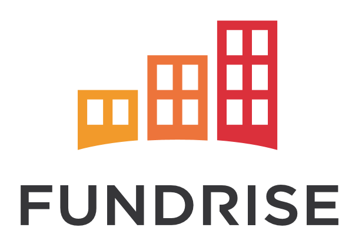
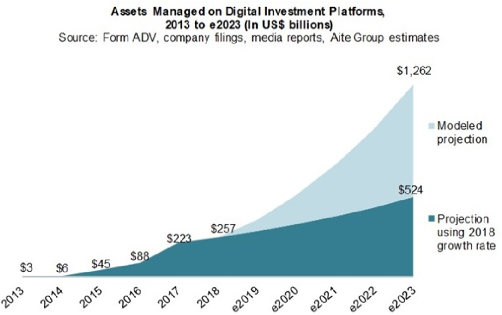
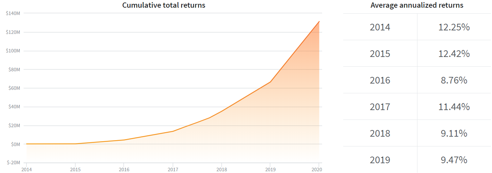
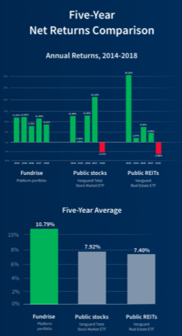
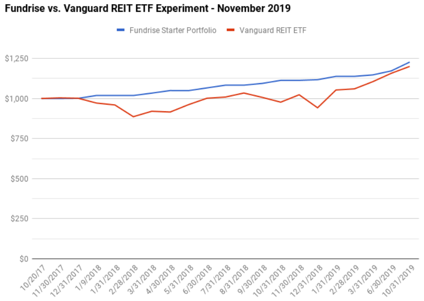

# Fintech Case Study
---

# FUNDRISE

  
## Overview and Origin

**Fundrise** is the first investment platform to create a simple, low-cost way for anyone to invest in real estate by minimizing fees and unlocking access for individuals with relatively small money

**Name of company**      

> Rise Companies Corp.

**When was the company incorporated?**   
  
> Founded in 2010   

**Who are the founders of the company?**    

> Brothers Ben and Dan Miller  

**How did the idea for the company (or project) come about?**    

> The brothers founded the company with the idea to allow residents in the D.C. area to invest in real estate development projects they were building. They knew there was a better way to invest, but that the majority of investors couldn’t get access to private investment alternatives. By building the first private market, direct investment platform, we’ve now made it possible for the everyday investor to have a portfolio like the most sophisticated, multi-billion dollar investment funds.   

**How is the company funded? How much funding have they received?**   

> Since inception through December 31, 2019, Fundrise has originated approximately $1.1 billion in both equity and debt investments deployed across more than approximately $4.9 billion of real estate property. Among them, $56 million from Renren, Guggenheim Partners and others. 

## Business Activities:

**What specific financial problem is the company or project trying to solve?**   

>  The company saw the commercial real estate market had been dominated by institutional funds, creating inefiiciencies and distortions:   
  - individual investors lack the size and market power to access quality real estate investments and therefore must rely on accessing investments through institutional channels, resulting in receiving less share of profits after deducting large fees, overhead, and profit sharing interests.    

  - Institutional funds tend to focus on large transactions in an effort to generate maximum profits relative to a fixed amount of work. This focus on only large transactions distorts the natural demand for these assets, increasing competition, and driving down returns. This further results in the individual, non-institutional investors receiving a lower relative risk-adjusted return.

**Who is the company's intended customer?  Is there any information about the market size of this set of customers?  What solution does this company offer that their competitors do not or cannot offer? (What is the unfair advantage they utilize?)**   
   
> Fundrise focuses on individuals who wish to invest in real estate with small capital. The Starter level gives investors the opportunity to open a Fundrise account with a minimum initial investment of $500.   
     
>The company owns and operates an online, direct investment technology platform called the Fundrise Platform. It enables thousands of individuals from across the country to create the scale of an institutional investor without the high fees and overhead typical of the old-fashioned investment business.  Investors use the Fundrise Platform to potentially earn attractive risk-adjusted returns from asset classes that have generally been closed to many investors and only available to high net worth investors and institutions.

>By combining sound investment principles with our proprietary web-based technology, we believe we have built a solution that will transform how the real estate capital markets operate, increasing their efficiency and transparency. Our model is built specifically to leverage the economies of scale created by the Internet to cut out excessive fees, while also lowering execution costs and reducing both time and manual resources.    

>Fundrise offers two primary investments, eREITs and eFunds. >eREITs are funds that invest in commercial real estate, including office buildings, retail shopping centers and related properties.

>Fundrise offers seven different eREITs:  

  |East Coast eREIT| Holds debt and equity investments in commercial properties located on the East Coast. | 
  | -------------------------| ------------------------------------|   
  | Heartland eREIT | Uses the same investment approach, except with properties located specifically in the Midwest region. |    
  | Income eREIT 2019| FInvests in senior and mezzanine debt with the aim of maximizing current income. It has a current annualized dividend of 8.50%. |
  | Income eREIT | Also invests primarily in debt investments to generate steady income, though it does this primarily by investing in smaller market properties. The current annual dividend yield is 7.50%. |    
  | Growth eREIT| Fund that focuses on acquiring commercial properties that have potential for capital appreciation. Invests primarily in multifamily properties, acquired at below market value. |
  | Growth eREIT 2019 | This is a recently created fund also oriented toward capital appreciation. |   
  | Growth eREIT V | New eREIT that has not yet acquired properties. Similar to the Growth eREIT, it will focus on capital appreciation. |     

**Which technologies are they currently using, and how are they implementing them?**   
 
> Fundrise uses Java, Amazon CloudFront, Google Analytics, Mixpanel, G Suite and AdRoll for its technology, according to [Stackshare](https://stackshare.io/companies/fundrise).

## Landscape:

**What domain of the financial industry is the company in?**   

> Alternative Investment – Real Estate, Crowdfunding.

**What have been the major trends and innovations of this domain over the last 5-10 years?**   

> Crowdfunding real estate investment platform are participating in and driving the third wave of a paradigm shift in the financial industry similar to the invention of and move to online brokerages and online payment systems that occurred in the late 1990s and 2000s, and the “marketplace lending” and automated registered investment advisor movements in the 2000s and 2010s.   

> The first wave of this paradigm was from physical brokerages to online brokerages, such as E*TRADE Financial Corp., TD Ameritrade Corp., and Charles Schwab Corp. that have grown their customer bases to 7 million to 11.8million accounts with $593billion to $3.5trillion in client assets, respectively.    

> The second wave of this paradigm shift is represented by technology-driven asset management companies such automated registered investment advisors, such as Wealthfront Inc. and Betterment, LLC. that have grown their assets under management to c.$11.5billion (with c.281K accounts) and $16.4billion (with c.542K accounts), respectively.  

> However, unlike online brokerage platforms, online payment processors, marketplace lending platforms, or automated registered investment advisors, Fundrise is focused on sponsoring and directly offering to investors (without the costs associated with such intermediaries), alternative investments, in particular real estate, which hit a record high of $8.8trillion in 2017 and was forecast to grow to $14trillion by 2023.

> The end-to-end integrated technology platform transforms the real estate origination, underwriting, funding, and servicing processes; replacing expensive sales and management teams with online and mobile applications, implementing data driven decision-making, and automating transactions through payment processing APIs. Through the new platform, Fundrise allows an individual investor to invest in the value (price per square foot) and yields available in the private real estate market.

>Because the entire system is built on an API-based, technology platform and utilizes data driven analysis and decision-making, the model is continuously improving and increasing in efficiency as the volume of data points increase exponentially and our automated processes undergo constant optimization.

**What are the other major companies in this domain?**   

> There are two different entities in the real estate investment, the traditional REITs and the crowdfunding or Fintech-based ones.    

> For traditional REITs, there are about 1,100 in the United States, among which 225 REITs are registered with the SEC that trade on one of the major stock exchanges - the majority on the NYSE.   

> If we narrow down to Fintech domain, Fundrise is competing with **Realty Mogul** and **Crowdstreet**. They all have common features in,    

  |Limited Liquidity | Real estate crowdfunding investments are long term in nature and typically can't be liquidated until the deal pays out. | 
  | -------------------------| ------------------------------------|   
  | Potential to Lose Money | True with all three platforms. |    
  | IRA Accounts | Offered by all three platforms. |
  | Customer Service | All three platforms are available only during regular business hours. |  

> Below are the areas where Fundrise, Realty Mogul and Crowdstreet differ.   

   |Platform Purpose| Fundrise and Realty Mogul invest in both commercial and residential properties. Crowdstreet invests only in commercial.| 
  | -------------------------| ------------------------------------|   
  | Accredited Investor Requirement | You must be an accredited investor to use Crowdstreet. Realty Mogul offers some investments that are only for accredited investors and others that are open to all. |    
  | Investments offered | Fundrise offers REITs and eFunds. Realty Mogul offers REITs and private placements. Crowdstreet offers investments in individual properties only. |
  | Fees | Fundrise and Crowdstreet are available in all 50 states. Realty Mogul doesn't indicate availability. |    
  | Availability| Offered by all three platforms. |
  | Income Distributions | Fundrise income distributions are monthly. Realty Mogul are monthly or quarterly. Crowdstreet distributions are monthly or less frequently, depending on the type of investment. |    

## Results

**What has been the business impact of this company so far?**    

> The most outstanding impact is that Fundrise has made investors prefer to invest through a web and mobile platform rather thatn a conventional platform or in person process. According to the company, the average age of investors was approximately 37 years old. These impacts illustrate the changing preferences and demographic trends underway in the industry. Moreover, client assets under management on robo-advice platforms is forecast to continue to grow.   

  

**What are some of the core metrics that companies in this domain use to measure success? How is your company performing, based on these metrics?**   

> We can measure success in the real estate investment by annualized returns. Based on these, Fundrise have well performed for six years.     

[Historical Performance]
   

**How is your company performing relative to competitors in the same domain?**   

> Based on the five-year net returns comparison with public REITs and public sotcks, represented by Vanguard Real Estate ETF and Vanguard Total Stock Market ETF, respectively, Fundrise outperformed the two benchmarks.   

    
    
> Also, here is an example comparing a Fundrise eREIT Portfolio and the Vanguard REIT ETF for two years with the same $1000 of initial investment. In Fundrise, we have a start-up that bought a concentrated basket of roughly 20 properties chosen from the private market. In Vanguard, we have a one of the largest real estate ETFs in the world that owns a passive slice of 184 public-traded REITs.

     

> The two eventually performed a quite similar level but we can see more fluctuation in values at Vanguard. Given the nature of publicly traded ETF, however, which Fundrise doesn't provide, we find it natrual that Fundrise is less correlatied with the market change than VNQ and performing well in the experiment. Curious to see how this plays out in the next 5 years? You may check this on [My money blog](https://www.mymoneyblog.com/fundrise-starter-portfolio-vs-reit-etf-review.html) for more information.

## Recommendations

**If you were to advise the company, what products or services would you suggest they offer?**   

> Two things. Firstly, you have to come up with making it more liquid. Most of the concepts and services you provide are outstanding. However, when it comes to liquidity, there is no way to cash out from your product unless you pay an additional redemption fee, which takes about 3 months though, or you have to wait until the 5 years period is over. The beauty of other traditional REITs lies in its trading at the exchange. You need to find a way to make it publicly tradable or to lessen the redemption period and relevant fee for providing investors with liquidity.   

>  Secondly, you need to consider about inducing foreign investors by providing a convenient, approachable platform for them. There are a lot of prospective individual investors outside the U.S. who interested in real estate investment in the U.S.properties. Two obstacles are refraining them from investing: Informational asymmetry and FX risk. 

>  You may solve the informational asymmetry by advertising online(Youtube, Portal, etc) and providing the same materials into different languages the prospective investors use. Foreign Exchange issues are more complicated. It can be a fear of depreciation of their local currencies against dollars and/or it can be a matter of regulation and relevant tax on their return. However, enabling cryptocurrencies may solve this problem where foreign investors buy cryptocurrencies in their local currency, transferring them to Fundrise’s account for further investments. Global regulations on cryptocurrency-based cross-border transfers(or investments) are by far difficult to establish as there are different views on cybermoney by nations and it takes time to achieve consensus. 

> We knew that you already have an invetment vehicle called "Opportunity Fund" which allows investors to defer federal taxes on any recent capital gains, reduce that tax payment by up to 5=15%. But that gives merely an alternative to save taxes for those who seek any 1031 exchange chances after having sold their cryptocurrencies for profit. We recommend extending your scope to add a platform to receive cryptocurrecies directly as a legit currency to REITs investment.

**Why do you think that offering this product or service would benefit the company?**   

> First of all, the more you make sure liquidity, the more individuals feel comfortable in using the platform. So far, you have been successful in lowering barriers investing in REITs, you may not keep that success unless you remove the clogs in your way to exit. Especially, people need quick cash in an uncertain environment like what we’ve been through for the last couple of months.

> On the other hand, you need to have more spectrum in terms of new customers. You have already given services in the 50 states and been in operation for 8 years. Quite a lot of people might have heard about you and some of them might even have tried investments through your platform. Also, there is an increasing number of competitors in the market with a similar platform as yours. This means the US market is packed. You need to turn your eyes to the new demands beyond. You have been successful in bringing and implementing new ideas as a pioneer. Now you need to do that again to be a pioneer again for opening up the gate to the US eREITs market for foreign individuals who eager to widen their portfolio. Not only you watch a significant growth in your new accounts, but you may also be able to find a new market opportunity to extend your investments overseas for US individuals.  

**What technologies would this additional product or service utilize?**
 >Blockchain is the technology behind cryptocurrency.   

**Why are these technologies appropriate for your solution?**

> Blockchain technology can tokenize real property, assets can then be traded much like stocks on an exchange. In this way, a seller doesn't have to wait for a buyer who can afford the whole property in order to get some value out of their property.   
By allowing fractional ownership, blockchain also lowers the barriers to real estate investing. Typically, investments would require significant money upfront in order to acquire property. Alternatively, investors with small capital could also pool their money to acquire bigger ticket properties. Through blockchain, investors would simply have to access a trading app to buy and sell even fractions of tokens as they see fit. In addition, fractional ownership would also help them avoid managing the properties themselves such as maintenance and leasing.
  
**References**  

https://fundrise.com/   
https://www.reit.com/what-reit/frequently-asked-questions-about-reits      
https://en.wikipedia.org/wiki/Fundrise      
https://www.sec.gov/cgi-bin/browse-edgar?action=getcompany&CIK=0001640967&owner=exclude&count=40&hidefilings=0      
https://www.mymoneyblog.com/fundrise-starter-portfolio-vs-reit-etf-review.html     
https://investorjunkie.com/reviews/fundrise/     
https://investorjunkie.com/real-estate/fundrise-vs-realty-mogul-vs-crowdstreet/       
https://www.doughroller.net/real-estate-investing/fundrise-vs-realty-mogul/      
https://www.investopedia.com/news/how-blockchain-technology-changing-real-estate/    
https://stackshare.io/companies/fundrise     
https://www.nerdwallet.com/reviews/investing/brokers/fundrise

